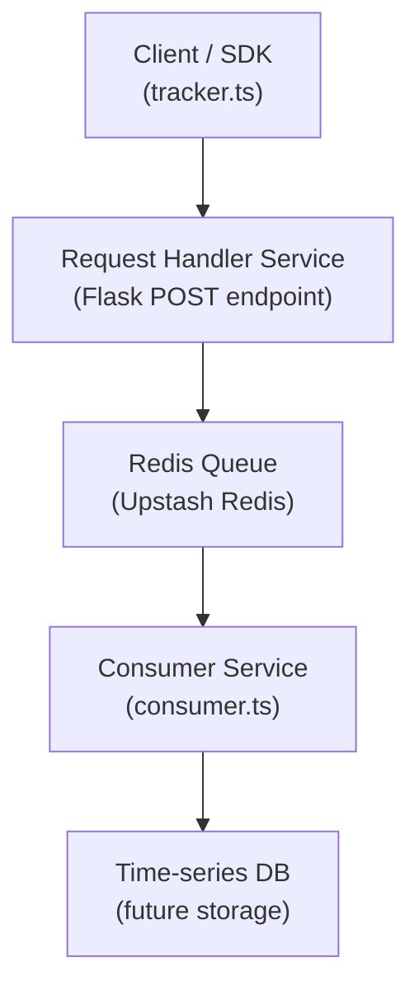

# LLM Tracker

A lightweight proof-of-concept for tracking LLM usage in an event-driven architecture.

This repository shows how a client-side LLM SDK can emit usage telemetry, route it through a request handler, and then store/consume it from an event queue.

## Project Concept

The code is intentionally simple and mock-based, but the architecture is designed around a core idea:

- Track LLM prompt/completion token usage
- Emit events from the SDK
- Buffer events in a queue
- Consume events asynchronously in a separate service

This is useful when you want usage tracking to be decoupled from request execution and when you want a scalable, event-style pipeline.

## Architecture

The project is split into three main pieces:

1. `sdk/`
   - Contains a mock `Tracker` that simulates an LLM call
   - Builds tracking payloads with model name, prompt tokens, and completion tokens
   - Intended to send events to the request handler

2. `requestHandlerService/`
   - A simple Flask app that accepts POST events
   - Pushes received tracking events into a Redis-backed queue
   - Represents the event entry point

3. `consumerService/`
   - A queue consumer that polls Redis and processes events
   - Represents the downstream consumer/storage component

> `dbService/` is currently empty in this repo, but the pattern implies this is where persisted usage events or analytics consumers would live.

## Event Flow

The tracking flow is:

1. Client code calls `sdk/src/tracker.ts`
2. `Tracker.proxy()` simulates an LLM response and builds a tracking payload
3. The payload is sent to `requestHandlerService/main.py`
4. The Flask service pushes the payload into a Redis queue using `LPUSH`
5. `consumerService/src/consumer.ts` polls the same queue with `RPOP`
6. The consumer processes the event and resets poll backoff

### Diagram

## What is mocked here

- `sdk/src/tracker.ts` does not call a real LLM.
- `sendPrompt()` returns randomized token usage values.
- `sendTrackRequest()` is a TODO placeholder for the actual HTTP/queue call.
- `consumerService` prints consumed events rather than persisting them.

## How to explore the code

- `sdk/src/tracker.ts` — mock tracking client
- `requestHandlerService/main.py` — POST endpoint and Redis enqueue logic
- `consumerService/src/consumer.ts` — Redis queue consumer
- `sdk/src/types.ts` — tracking payload and response type definitions

## Notes

- The architecture is intentionally simple and can be expanded into a real tracking pipeline.
- In production, replace the mock LLM and TODO HTTP call with a real LLM request + event transport.
- Add persistent storage, metrics, and retries to make this a full observability pipeline.
